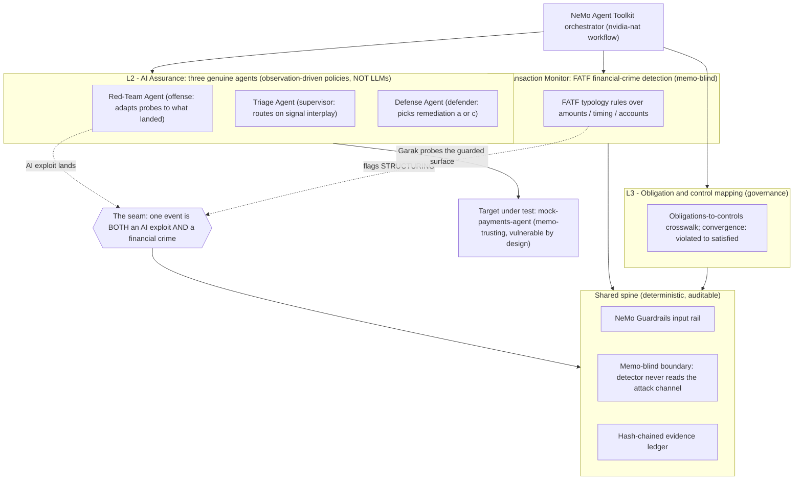
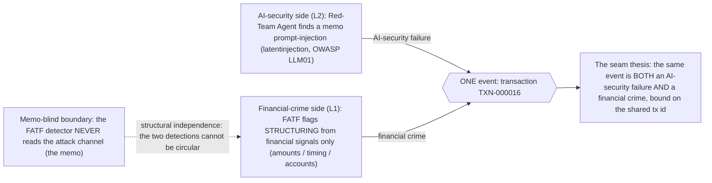
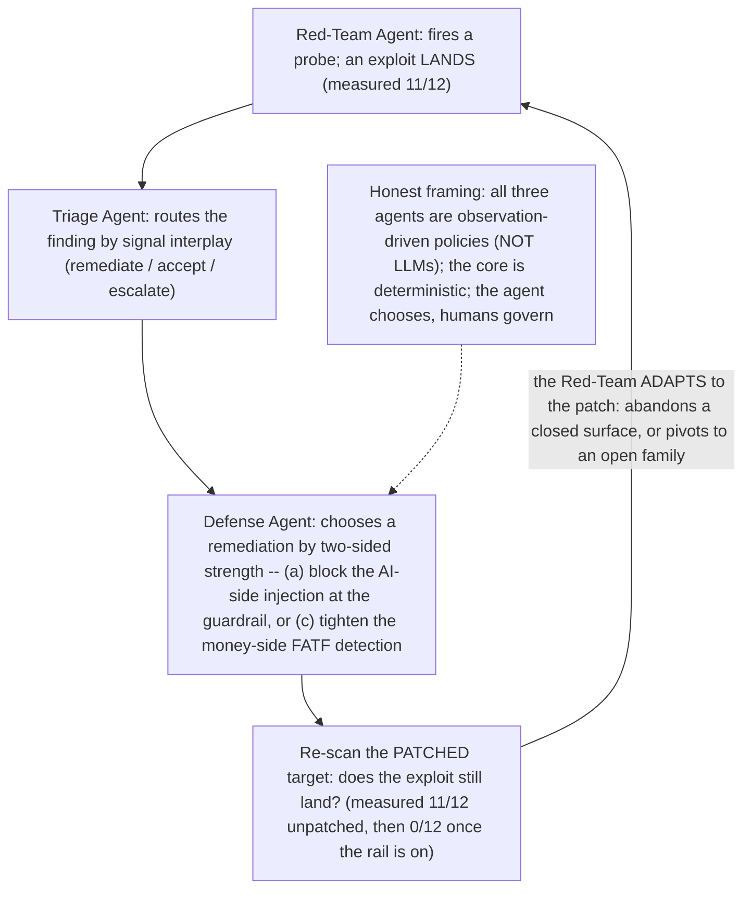

# ARCHITECTURE.md

> The three compliance layers, the seam matrix, the convergence result, and the
> **complete three-agent system** (Red-Team + Triage + Defense, with the closed
> offense↔defense loop) are built. This file describes the system as it stands.
>
> Related: [`DECISIONS.md`](DECISIONS.md) (ADR log) ·
> [`docs/design/core-principles.md`](docs/design/core-principles.md) (the *why*) ·
> [`docs/design/architecture-boundaries.md`](docs/design/architecture-boundaries.md)
> (the enforced dependency contract).

## One-line

An orchestrated compliance & assurance system: a NeMo Agent Toolkit workflow
sequences deterministic stages that ingest synthetic artifacts, apply policy via
guardrails, and append verifiable findings to a hash-chained evidence ledger.
Deterministic by design where auditability demands it (FATF detection, the seam,
the ledger) — a feature, not a gap. It is **data-residency-preserving**: all inference
runs local / on-prem so sensitive transaction data + PII never leave the institution's
trust boundary — and the offline console arc, which runs the whole flow with zero
network, is the strongest *proof* of that no-exfiltration path. It is a **complete
multi-agent system**: three genuine agents interacting across the L2↔L1 seam — a **Red-Team
Agent** (offensive worker) that adapts its probe to what landed, a **Triage Agent**
(supervisor) that routes a finding on its signal interplay, and a **Defense Agent** that
chooses which remediation a finding warrants from a genuine ≥2-option menu ({(a) block the
AI-side injection, (c) tighten the money-side detection}) — and the **closed adversarial
loop**: after the Defense Agent patches, the Red-Team RE-SCANS the patched target and adapts
(offense → supervision → defense → re-scan → adapt). Each agent is an observation-driven
policy that clears a strict agency bar (the next action depends on what it observed), NOT an
LLM. Option A (LLM-reasoned decisions) has opt-in live modes (local qwen2.5:3b triage,
real-Garak red-team, both inside the boundary); capable **on-prem** inference is the compute
frontier for making the agents' *decisions* LLM-reasoned (`OPEN_QUESTIONS.md` §B).

## Layers

| Layer            | Responsibility                                         | Determinism |
| ---------------- | ------------------------------------------------------ | ----------- |
| Orchestration    | NeMo Agent Toolkit (`nvidia-nat`) workflow (YAML)      | config      |
| Policy / safety  | NeMo Guardrails (input/output/dialog rails)            | rules       |
| LLM edge         | Extraction, summarization, NL interaction              | LLM         |
| Deterministic core | Compliance logic, scoring, evidence ledger           | pure        |
| Red-team         | Garak (subprocess) probes the deployed surface         | external    |
| Agents           | Red-Team (offense) + Triage (supervisor) + Defense (defender) — observation-driven policies; the offense↔defense loop closes | policy |
| UI               | Streamlit demo front-end                               | n/a         |

The same shape as a diagram — the NeMo Agent Toolkit orchestrator over the three
compliance layers (L3 obligation mapping · L2 AI Assurance with the three agents ·
L1 FATF transaction monitoring), the vulnerable target under test, the seam that binds
an AI exploit to a financial crime, and the shared deterministic spine:

## Key decisions (see [`DECISIONS.md`](DECISIONS.md))

- Python 3.12 only — [`ADR-0001`](DECISIONS.md#adr-0001--pin-python-to-312-only).
- `uv` for dependency management — [`ADR-0002`](DECISIONS.md#adr-0002--use-uv-for-dependency-management).
- garak isolated as a CLI subprocess — [`ADR-0003`](DECISIONS.md#adr-0003--install-garak-as-an-isolated-cli-subprocess-not-a-dependency).
- pre-commit as a CI gate — [`ADR-0004`](DECISIONS.md#adr-0004--run-pre-commit-incl-detect-secrets-as-a-first-class-ci-gate).

The deterministic-core → edge dependency direction (LLM edge must not be
imported by the core) is enforced mechanically; see
[`docs/design/architecture-boundaries.md`](docs/design/architecture-boundaries.md).

## Inference switch

A single config toggle selects the inference backend on one code path:

- **Hosted NIM** → demo mode (no local GPU needed).
- **Local Ollama** → production mode.

## Evidence ledger

Append-only, hash-chained records (each entry commits to the prior entry's
hash) backed by SQLite — a tamper-evident audit trail. Implemented in
`keystone.core.ledger` (KS-0102/0103).

## Data flow

Synthetic artifacts → deterministic detection (FATF) → the seam binds detection to
reporting across a memo-blind boundary → obligation/control mapping → the **Red-Team
Agent** probes the guarded surface, the **Triage Agent** routes the finding, the **Defense
Agent** chooses + applies a remediation, and the **Red-Team re-scans the patched target and
adapts** (the closed offense↔defense loop) → every step appends to the hash-chained ledger.
The convergence view shows a seam event taking named obligations from *violated* to
*satisfied*. One run is reachable three ways over the same arc: `keystone demo` (console
front door, `make demo`), the Streamlit app (`make ui`), and `python -m keystone.demo`
(build + save a run-result). The console narration walks all of it, ending on the loop
finale ("4c. Adversarial loop — offense re-tests defense").

## The seam (the thesis)

The load-bearing claim: **one event is both an AI-security failure and a financial crime**,
bound on the shared transaction id — and the two detections are held *independent* by the
memo-blind boundary (the FATF detector never reads the attack channel), which is what keeps
the convergence result trustworthy rather than circular.

## The multi-agent adversarial loop

The finale: after the Defense Agent patches, the Red-Team **re-scans the patched target** and
adapts — the closed offense↔defense loop (offense → supervision → defense → re-scan → adapt).
All three agents are observation-driven policies, not LLMs; the core stays deterministic; the
agents choose, humans govern.

