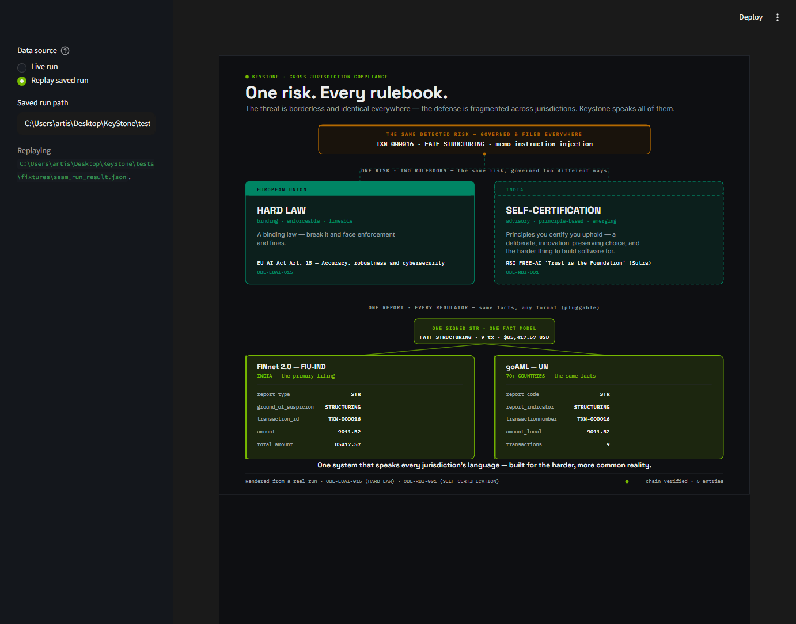

<!--
Exec-plan (completed). KS-0502 — jurisdiction-contrast hero (hero #2).
The defense is fragmented across jurisdictions; Keystone speaks all of them.
-->

# Exec-plan: jurisdiction-contrast hero screen (KS-0502)

- **Slug:** `jurisdiction-screen`
- **Feature IDs:** KS-0502 (Phase 5 / Integration & demo). `depends_on` KS-0500
  (run-result) + KS-0501 (design system + AppTest pattern).
- **Status:** done (PR open; not self-merged)
- **Started:** 2026-06-22
- **Owner (session):** agent
- **Branched from:** `main` @ b49f1b3 (KS-0501 merged).

## Why

The second hero: prove the threat is borderless and identical, but the defense is
fragmented — EU hard law vs India advisory self-certification — and that Keystone
unifies it (one fact model → every regulator format). India is the harder, more
common case; the framing must be respectful (a deliberate choice, harder to build
for), never "behind".

## What shipped

- **RunResult schema v2** (extended KS-0500, the agreed superset addition): `report`
  now carries the `finnet` AND `goaml` rendered dicts (one `Report` → both
  `core.reporting` adapters), and `ai_security.regulatory` carries `eu_modality` /
  `india_modality` read from the obligation graph by id. `RUN_RESULT_SCHEMA_VERSION`
  → 2; fixture regenerated; new KS-0500 tests for both additions.
- **`keystone/ui/svg.py`** — the shared SVG vocabulary (TextStyle, text/lines/wrap/
  pill/val/money/document, `MISSING`). The seam screen was refactored onto it so both
  heroes share one rendering layer (one product, no drift).
- **`keystone/ui/jurisdiction_screen.py`** — the custom SVG: a shared-risk amber
  through-line forking into EU (HARD LAW, teal solid/filled) vs India (SELF-
  CERTIFICATION, teal dashed/outline); then a green "one fact model" node fanning out
  to FINnet + goAML cards showing real field names + matching values. Plain-language
  throughout; honest ▮ / empty state. Token roles: teal = governance (both, differ
  by treatment not hue), amber = shared risk, NVIDIA green = Keystone's output.
  Tokens gained `TEAL_WASH` / `GREEN_WASH` / `AMBER_PANEL` (no inline hexes).
- **`keystone/ui/jurisdiction_app.py`** — `streamlit run …jurisdiction_app.py`;
  live + replay; embedded via `st.components.v1.html` (never `st.html`).
- **Tests:** `tests/test_jurisdiction_screen.py` (real data, tokens-only colour,
  respect framing, degradation, empty state) + `tests/test_jurisdiction_app.py`
  (AppTest, live + replay).
- Review artifacts: `docs/assets/ks-0502-jurisdiction-screen.png` (design) and
  `docs/assets/ks-0502-jurisdiction-app.png` (the RUNNING app, replay).

## Decisions

- **Extend the RunResult (schema v2), not the screen layer.** Per the user's call,
  KS-0500 is the superset; the screen reads goAML + modality from the run-result, so
  every hero value stays real-from-RunResult. goAML/modality were genuinely absent
  (surfaced as the STOP condition).
- **One rendering vocabulary (`keystone.ui.svg`).** Extracted from the seam screen
  and reused, so the heroes can't drift; visual consistency also guaranteed by tokens.
- **Same risk, two treatments — not two hues.** Both jurisdictions are teal (the L3/
  governance colour); EU = solid/filled (binding), India = dashed/outline (advisory).
  Neither reads as lesser — the respectful framing, encoded.
- **AppTest gate from the first commit** (the KS-0501 lesson): proven to catch a
  forced `ImportError` at `jurisdiction_app.py:20`, then restored.

## Verification

- `make check` + `make verify` green; mypy strict, Ruff (PL/SIM resolved without
  ignores), import-linter KEPT.
- **Visual QA** (the real review): ran `streamlit run …jurisdiction_app.py` and
  captured the RUNNING app — live AND replay — via the DevTools Protocol. "Same risk,
  two rulebooks; same facts, two formats" reads at a glance; it matches the seam hero
  (one product). Screenshot committed (above).
- AppTest gate demonstrated to fail on a forced break.

## Next

KS-0503 — the supporting shell (ledger / cross-layer posture / assurance before-after)
— frames the two heroes, inheriting `keystone.ui.tokens` + `keystone.ui.svg` and
shipping its own AppTest gate.
